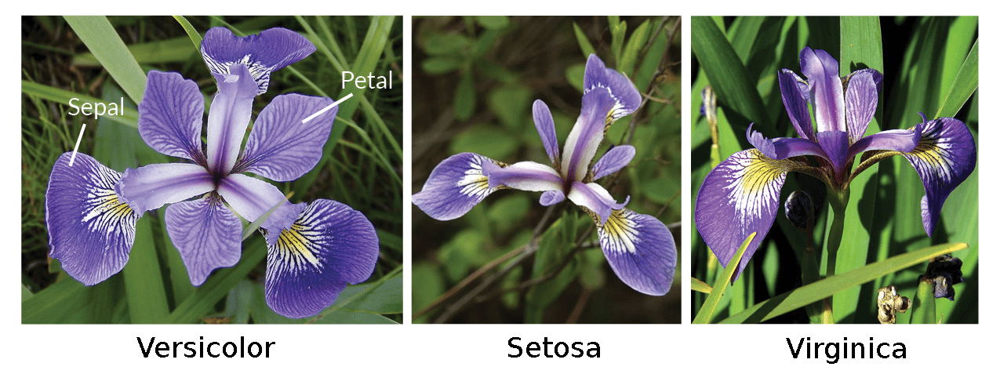

By Erik Boström

"iris"" is a predefined dataframe available within R. It is a probably the most known dataset available for testing, first analyzed in @fisher1936use. It contains the length and width of measurements from three different iris species "Setosa", "Versicolor" and "Virginica".

#

```{r}
str(iris)
```
There are 50 samples each for each of the species:
```{r}
#iris$Species <- as.character(iris$Species)
table(iris$Species)
```
```{r}
summary(iris[iris$Species=="setosa",])
summary(iris[iris$Species=="versicolor",])
summary(iris[iris$Species=="virginica",])
```
```{r}

```
The different species differ significantly in length, especially the petal:
```{r fig.height = 6, fig.width = 6}
library(ggplot2)
p   <- "Set2"
sfb <- scale_fill_brewer(palette=p)
t   <- theme_light()
p1 <- ggplot(iris, aes(x=Sepal.Length, fill=Species)) + geom_histogram(color="black",size=0.3,binwidth=0.05) + sfb + t
p2 <- ggplot(iris, aes(x=Petal.Length, fill=Species)) + geom_histogram(color="black",size=0.3,binwidth=0.05) + sfb + t
grid.arrange(p1, p2, ncol=1)
```

```{r fig.height = 6, fig.width = 6}
require(gridExtra)
p1 <- ggplot(iris, aes(x=Species,y=Sepal.Length,fill=Species))  + geom_boxplot(color="black",size=0.3,show.legend = FALSE) + sfb + t
p2 <- ggplot(iris, aes(x=Species,y=Sepal.Width, fill=Species))  + geom_boxplot(color="black",size=0.3,show.legend = FALSE) + sfb + t
p3 <- ggplot(iris, aes(x=Species,y=Petal.Length, fill=Species)) + geom_boxplot(color="black",size=0.3,show.legend = FALSE) + sfb + t
p4 <- ggplot(iris, aes(x=Species,y=Petal.Width, fill=Species))  + geom_boxplot(color="black",size=0.3,show.legend = FALSE) + sfb + t
grid.arrange(p1, p2, p3, p4, ncol=2)
```

```{r fig.height = 8, fig.width = 6}
scb = scale_color_brewer(palette=pal)
p1 <- ggplot(iris,aes(x=Sepal.Length,y=Sepal.Width)) + geom_point(aes(color=Species),size=2) + scb + t
p2 <- ggplot(iris,aes(x=Petal.Length,y=Petal.Width)) + geom_point(aes(color=Species),size=2) + scb + t
grid.arrange(p1, p2, ncol=1)
```
## Machine learning
We want to predict the Species based on input measurements of the sepal and petal lengths and widths.
```{r}
set.seed(1234)
```
To index elements to test and trial sets, construct a random vector of the same size as the datasets with values of either 0 or 1 randomly distributed, 0 to a training set (2/3 of the dataset), and 1 to a test set (1/3 of the dataset).
```{r}
I <- sample(c(0,1), nrow(iris), replace=TRUE, prob=c(2/3, 1/3))
prop.table(table(I))
```
Construct training and test sets
```{r}
iris.train        <- iris[I==0,1:4]
iris.train_full   <- iris[I==0,]
iris.train_labels <- iris[I==0,5]
iris.test         <- iris[I==1,1:4]
iris.test_full    <- iris[I==1,]
iris.test_labels  <- iris[I==1,5]
```
### k-NN -- kth Nearest Neighbour
Let us now employ the simple k-NN algorithm to the training set
```{r}
library(class)
iris_knn <- knn(train=iris.train, test=iris.test, cl=iris.train_labels, k=3)
iris_knn
```
#### Validation
Compare to the test-data labels. Put evaluated labels side-by-side to the test-data labels.
```{r}
comp <- data.frame(iris_knn,data.frame(iris.test_labels))
names(comp) <- c("kNN predicted Species","Correct Species")
count <- 0
j <- 1
err <- 0
for(i in 1:length(comp[,1])){
  if (comp[i,1]==comp[i,2]){
    count = count + 1
    }else{
      err[j] <- i
      j <- j+1
    }
}
print(paste(count,"out of",length(comp[,1]),"predicted correctly! This is",100*count/length(comp[,1]), "percent correct."))
```
The wrongly predicted quantities were
```{r}
comp[err,]
```

```{r}
library(gmodels)
CrossTable(x=iris.test_labels, y=iris_knn, prop.chisq = FALSE)
```
### Conclusion
The kNN algoritm works suffently well on the iris data. A prediction of the seposa is perfect. This, due to the fact that it distinctly separates from the other two in both the sepal and petal data. On the other hand, there are overlap in the versicolor and virgicinca data which makes the classification of them harder. Despite this, the kNN did a rather accurate job in predicting them too with only 2 out of 28 prdictions wrong.

## Random forests
Random forests is a method that can be used to classify data and is about generation of a large number of decision trees.
```{r}
# Import the random forest package
library(randomForest)
# Compute the training
iris_randomforest <- randomForest(Species~ . , data=iris.train_full, ntree=100, mtry=2, importance=TRUE,proximity=TRUE)
iris_randomforest
```
Since the data contains more than one class (three) the data is *impure* (inhomogeneuous).  
  
**Definition.** An *impurity measure* defines how well classes are separated.  
  
The Gini impurity (named after the Italian statistician and sociologist Corrado Gini) is computed as follows
$$ I_G =  1-\sum_{i=1}^J p_i^2, $$
where $J$ is the number of classes, and $\{p_i\}_{i=1}^J$ a set of individual probabilities

```{r fig.height = 2.5, fig.width = 6}
imp <- varImpPlot(iris_randomforest)
graphics.off()
imp <- data.frame(imp)
p1 <- ggplot(imp,aes(y=row.names(imp),x=MeanDecreaseAccuracy)) + geom_point() + t + xlab("Mean accuracy loss [%]") + ylab(NULL)
p2 <- ggplot(imp,aes(y=row.names(imp),x=MeanDecreaseGini)) + geom_point() + t + xlab("Mean Gini impurity decrease [%]") + ylab(NULL)
grid.arrange(p1, p2, ncol=2)
```
Here the plots show the mean accuracy loss and the mean Gini impurity decrease when one of the four variables is removed from the training set. The decrease in Gini impurity shows how important that variable is to split the data correctly or in other words how "pure" the final node in the decision trees are. It is noticeable that the Petal data is weighted higher than the sepal data in the random forests algorithm.
Now, let's use the classifier
```{r}
prediction <- predict(iris_randomforest,iris.test_full)
table(observed=iris.test_labels, predicted=prediction)
```
Thus, the result obtained is for this simple example dataset similar to the predicted result of the k-NN method. For both very good.
